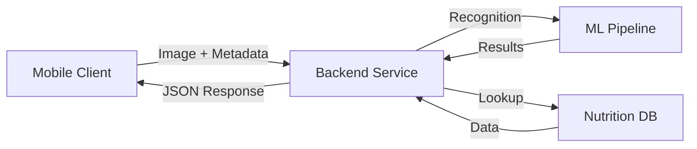

# Nutrition Counter — App Flow & Feature Specification

> **Purpose**: To provide a clear, developer-friendly specification detailing the app flow, screens, UI states, data flow, API contracts, and implementation notes for a mobile Nutrition Counter app that estimates calories and macronutrients from captured or imported images.

## Tech stack

Frontend: React Native with TypeScript, Expo, and Expo Router
Backend/Database: Supabase
UI Framework: React Native Paper
AI Processing: DeepSeek

## Table of Contents

- [1. Summary / Goal](#1-summary--goal)
- [2. High-level User Flow](#2-high-level-user-flow)
- [3. Screens & UI Details](#3-screens--ui-details)
- [4. Data Flow & Architecture](#4-data-flow--architecture)
- [5. API Contract](#5-api-contract)
- [6. Image Processing & ML Notes](#6-image-processing--ml-notes)
- [7. Edge Cases & Error Handling](#7-edge-cases--error-handling)
- [8. State Machine](#8-state-machine)
- [9. Accessibility & Permissions](#9-accessibility--permissions)
- [10. Analytics & Logging](#10-analytics--logging)
- [11. Privacy & Storage](#11-privacy--storage)
- [12. Implementation Checklist](#12-implementation-checklist)
- [13. Developer Acceptance Criteria](#13-developer-acceptance-criteria)

## 1. Summary / Goal

A mobile application that:
- Opens directly to camera mode
- Requests camera permissions on first run
- Allows meal photo capture or library import
- Processes images through nutrition analysis pipeline
- Displays nutrition statistics (calories, protein, carbs, fat)
- Provides confirmation flow with back/retry options
- Emphasizes speed, clarity, and fault tolerance

## 2. High-level User Flow

### First Launch
1. **Permission Request**
   - Display permissions modal with camera access explanation
   - Trigger system-level permission prompt
   - Proceed to camera screen upon acceptance

### Main Flow
2. **Camera Screen** (Default View)
   - Professional camera UI with:
     - Full-screen viewfinder
     - Centered capture button
     - Library import option
     - Flash and camera controls
     - Framing guidance overlay

3. **Image Acquisition**
   - Photo capture or library import
   - Processing animation
   - Transition to results view

4. **Results Display**
   - Nutrition statistics table
   - Confidence indicators
   - Image thumbnail
   - Action buttons (Confirm/Back)
   - Edit capabilities for multi-food scenes

5. **Post-Confirmation**
   - Save to local/cloud storage
   - Success indication
   - Optional daily summary

## 3. Screens & UI Details

### 3.1 Permissions Modal

Component | Details
----------|----------
Title | "Camera Access Needed"
Message | "We need camera access to analyze your meals and estimate nutrition"
Actions | \`Allow\` / \`Maybe Later\`
Fallback | Instructions for settings access if denied

### 3.2 Camera Screen

#### Core Elements
- Full-screen viewfinder
- Prominent capture button (bottom center)
- Library access (bottom left corner)
- Control panel (top)
  - Flash toggle
  - Camera switch
  - Settings (optional)
- Helper overlay
  - Framing guides
  - Portion hints

#### Screen States
- Idle (default view)
- Capturing (with animation)
- Processing (overlay)
- Permission-denied (with CTA)

### 3.3 Review Screen (Optional)

- Quick preview display
- Action buttons:
  - \`Use Photo\`
  - \`Retake\`

### 3.4 Results Screen

Component | Details
----------|----------
Header | Thumbnail with edit option
Main Content | Nutrition table (per serving)
Stats | Weight estimate + confidence score
Actions | Primary: OK/Back, Secondary: Adjust/Manual
Multi-food | Segmented list with toggles

## 4. Data Flow & Architecture



### Process Flow
1. **Client-side Processing**
   - Image capture/import
   - Preprocessing (resize/compress)
   - Metadata collection

2. **Server Processing**
   - Image segmentation
   - Food recognition
   - Portion estimation
   - Nutrition calculation

3. **Result Handling**
   - Display processing
   - User validation
   - Local storage
   - Optional sync

## 5. API Contract

### Analyze Endpoint

\`\`\`http
POST /analyze
Content-Type: multipart/form-data
\`\`\`

#### Request Parameters

Field | Type | Required | Description
------|------|----------|-------------
image | file | Yes | The meal photo
orientation | string | Yes | Image orientation
user_id | string | No | Optional user identifier

#### Response Format

\`\`\`json
{
  "status": "ok",
  "confidence": 0.86,
  "weight_g": 320,
  "items": [
    {
      "id": "item_1",
      "label": "Grilled chicken",
      "confidence": 0.93,
      "weight_g": 150,
      "calories": 275,
      "protein_g": 52,
      "carbs_g": 0,
      "fat_g": 7
    },
    {
      "id": "item_2",
      "label": "Steamed rice",
      "confidence": 0.89,
      "weight_g": 170,
      "calories": 220,
      "protein_g": 4,
      "carbs_g": 48,
      "fat_g": 0.4
    }
  ],
  "totals": {
    "calories": 495,
    "protein_g": 56,
    "carbs_g": 48,
    "fat_g": 7.4
  }
}
\`\`\`

## 6. Image Processing & ML Notes

### Preprocessing Pipeline
- Auto-orientation correction
- Resize to max 1024px
- JPEG compression (~70%)

### ML Implementation
- On-device: MobileNet classifier + segmentation
- Portion estimation:
  - Mask area analysis
  - Reference object detection
  - Heuristic combinations

### Data Sources
- USDA nutrition database
- Verified per-100g values
- Custom training data

## 7. Edge Cases & Error Handling

Scenario | Handling
---------|----------
Permission Denied | Show settings instructions + library fallback
Low Confidence | Display warning badge + manual correction option
Segmentation Issues | Enable manual food separation
Network Failure | Queue for retry + offline estimation
Bad Image Quality | Provide capture guidance + retry option

## 8. State Machine

\`\`\`mermaid
stateDiagram-v2
    [*] --> AppLaunch
    AppLaunch --> Camera: Permission OK
    Camera --> Preview: Capture
    Preview --> Processing: Accept
    Preview --> Camera: Retry
    Processing --> Results: Success
    Results --> Camera: Back
    Results --> Saved: OK
    Saved --> Camera
\`\`\`

## 9. Accessibility & Permissions

### Accessibility Features
- Screen reader support
- Dynamic font sizing
- High contrast mode
- Touch target sizing
- Gesture alternatives

### Permission Handling
- Clear purpose explanation
- Graceful degradation
- Easy settings access
- Privacy-first approach

## 10. Analytics & Logging

### Key Events
- \`app_launch\`
- \`permission_prompt_shown\`
- \`permission_granted\`
- \`capture_taken\`
- \`image_imported\`
- \`analysis_requested\`
- \`analysis_result_received\`
- \`result_confirmed\`
- \`result_edited\`
- \`network_error\`

### Metrics
- Success rates
- Processing times
- Error frequencies
- User engagement

## 11. Privacy & Storage

### Data Handling
- Minimal PII collection
- Optional image storage
- Clear retention policies
- Local-first approach

### Features
- Data export (CSV)
- Bulk delete option
- Storage management
- Sync preferences

## 12. Implementation Checklist

### Mobile Camera Integration
- Android: \`CameraX\`
- iOS: \`AVFoundation\`
- Cross-platform: Expo Camera/React Native Vision

### Core Libraries
Component | Options
----------|----------
Image Picker | react-native-image-picker
Networking | Retrofit, Alamofire, axios
Storage | SQLite, Realm
ML | TensorFlow Lite, CoreML
Backend | PyTorch/TF serving

## 13. Developer Acceptance Criteria

1. ✓ Permission flow works on first launch
2. ✓ Camera view loads post-permission
3. ✓ Capture/import functions properly
4. ✓ Results display accurately
5. ✓ Navigation works as expected
6. ✓ Error states handled gracefully

## Implementation Notes

### Priority Features
- Fast camera load time
- Quick analysis feedback
- Clear error messaging
- Intuitive navigation

### User Experience
- Minimal UI complexity
- Quick actions prioritized
- Clear feedback loops
- Graceful degradation

---

> **Note**: Keep the Results screen minimal and actionable. Users should understand totals at a glance and be able to correct mistakes quickly. Consider adding brief onboarding tips (1-2 slides) covering photo techniques, portion estimation, and privacy options.

---

## 14. Database Schema (Supabase)

### 14.1 Tables

#### **users**
Stores user profile and authentication data.

```sql
CREATE TABLE users (
  id UUID PRIMARY KEY DEFAULT uuid_generate_v4(),
  email TEXT UNIQUE,
  created_at TIMESTAMP WITH TIME ZONE DEFAULT NOW(),
  updated_at TIMESTAMP WITH TIME ZONE DEFAULT NOW(),
  full_name TEXT,
  avatar_url TEXT,
  preferences JSONB DEFAULT '{}'::jsonb,
  -- Preferences: { theme, units, dailyGoals, notifications }
  CONSTRAINT users_email_check CHECK (email ~* '^[A-Za-z0-9._%+-]+@[A-Za-z0-9.-]+\.[A-Za-z]{2,}$')
);

CREATE INDEX idx_users_email ON users(email);
```

#### **meals**
Stores meal records with analysis results.

```sql
CREATE TABLE meals (
  id UUID PRIMARY KEY DEFAULT uuid_generate_v4(),
  user_id UUID NOT NULL REFERENCES users(id) ON DELETE CASCADE,
  created_at TIMESTAMP WITH TIME ZONE DEFAULT NOW(),
  updated_at TIMESTAMP WITH TIME ZONE DEFAULT NOW(),
  meal_type TEXT CHECK (meal_type IN ('breakfast', 'lunch', 'dinner', 'snack')),
  image_url TEXT,
  image_storage_path TEXT,
  thumbnail_url TEXT,

  -- Analysis metadata
  confidence_score DECIMAL(3,2) CHECK (confidence_score BETWEEN 0 AND 1),
  total_weight_g DECIMAL(8,2),
  processing_status TEXT DEFAULT 'pending' CHECK (processing_status IN ('pending', 'processing', 'completed', 'failed')),
  error_message TEXT,

  -- Aggregated nutrition totals
  total_calories DECIMAL(8,2),
  total_protein_g DECIMAL(8,2),
  total_carbs_g DECIMAL(8,2),
  total_fat_g DECIMAL(8,2),
  total_fiber_g DECIMAL(8,2),
  total_sugar_g DECIMAL(8,2),

  -- User modifications
  is_edited BOOLEAN DEFAULT FALSE,
  notes TEXT,

  -- Soft delete
  deleted_at TIMESTAMP WITH TIME ZONE
);

CREATE INDEX idx_meals_user_id ON meals(user_id);
CREATE INDEX idx_meals_created_at ON meals(created_at DESC);
CREATE INDEX idx_meals_user_date ON meals(user_id, created_at DESC);
CREATE INDEX idx_meals_deleted ON meals(deleted_at) WHERE deleted_at IS NULL;
```

#### **food_items**
Individual food items detected in each meal.

```sql
CREATE TABLE food_items (
  id UUID PRIMARY KEY DEFAULT uuid_generate_v4(),
  meal_id UUID NOT NULL REFERENCES meals(id) ON DELETE CASCADE,
  created_at TIMESTAMP WITH TIME ZONE DEFAULT NOW(),

  -- Food identification
  label TEXT NOT NULL,
  food_database_id TEXT, -- Reference to USDA or custom food DB
  confidence_score DECIMAL(3,2) CHECK (confidence_score BETWEEN 0 AND 1),

  -- Portion data
  weight_g DECIMAL(8,2),
  serving_size TEXT,
  quantity DECIMAL(6,2) DEFAULT 1,

  -- Nutrition per item
  calories DECIMAL(8,2),
  protein_g DECIMAL(8,2),
  carbs_g DECIMAL(8,2),
  fat_g DECIMAL(8,2),
  fiber_g DECIMAL(8,2),
  sugar_g DECIMAL(8,2),
  sodium_mg DECIMAL(8,2),

  -- Segmentation data
  bounding_box JSONB, -- {x, y, width, height}
  mask_data TEXT, -- Base64 encoded mask or polygon points

  -- User modifications
  is_manually_added BOOLEAN DEFAULT FALSE,
  is_edited BOOLEAN DEFAULT FALSE
);

CREATE INDEX idx_food_items_meal_id ON food_items(meal_id);
CREATE INDEX idx_food_items_label ON food_items(label);
```

#### **nutrition_database**
Reference database for food nutrition information.

```sql
CREATE TABLE nutrition_database (
  id UUID PRIMARY KEY DEFAULT uuid_generate_v4(),
  food_name TEXT NOT NULL,
  food_name_normalized TEXT NOT NULL, -- Lowercase, trimmed for search
  category TEXT,
  source TEXT DEFAULT 'USDA', -- USDA, custom, user-contributed

  -- Nutrition per 100g
  calories_per_100g DECIMAL(8,2),
  protein_per_100g DECIMAL(8,2),
  carbs_per_100g DECIMAL(8,2),
  fat_per_100g DECIMAL(8,2),
  fiber_per_100g DECIMAL(8,2),
  sugar_per_100g DECIMAL(8,2),
  sodium_per_100g DECIMAL(8,2),

  -- Additional metadata
  common_serving_sizes JSONB, -- [{name: "cup", grams: 240}, ...]
  aliases TEXT[], -- Alternative names

  created_at TIMESTAMP WITH TIME ZONE DEFAULT NOW(),
  updated_at TIMESTAMP WITH TIME ZONE DEFAULT NOW()
);

CREATE INDEX idx_nutrition_db_name ON nutrition_database(food_name_normalized);
CREATE INDEX idx_nutrition_db_category ON nutrition_database(category);
CREATE INDEX idx_nutrition_db_aliases ON nutrition_database USING GIN(aliases);
```

#### **daily_summaries**
Aggregated daily nutrition statistics.

```sql
CREATE TABLE daily_summaries (
  id UUID PRIMARY KEY DEFAULT uuid_generate_v4(),
  user_id UUID NOT NULL REFERENCES users(id) ON DELETE CASCADE,
  date DATE NOT NULL,

  -- Daily totals
  total_calories DECIMAL(8,2) DEFAULT 0,
  total_protein_g DECIMAL(8,2) DEFAULT 0,
  total_carbs_g DECIMAL(8,2) DEFAULT 0,
  total_fat_g DECIMAL(8,2) DEFAULT 0,
  total_fiber_g DECIMAL(8,2) DEFAULT 0,

  -- Meal counts
  meal_count INTEGER DEFAULT 0,

  -- Goals (can be user-specific or default)
  calorie_goal DECIMAL(8,2),
  protein_goal_g DECIMAL(8,2),
  carbs_goal_g DECIMAL(8,2),
  fat_goal_g DECIMAL(8,2),

  created_at TIMESTAMP WITH TIME ZONE DEFAULT NOW(),
  updated_at TIMESTAMP WITH TIME ZONE DEFAULT NOW(),

  UNIQUE(user_id, date)
);

CREATE INDEX idx_daily_summaries_user_date ON daily_summaries(user_id, date DESC);
```

#### **analysis_logs**
Logs for AI analysis requests and responses.

```sql
CREATE TABLE analysis_logs (
  id UUID PRIMARY KEY DEFAULT uuid_generate_v4(),
  meal_id UUID REFERENCES meals(id) ON DELETE SET NULL,
  user_id UUID REFERENCES users(id) ON DELETE SET NULL,
  created_at TIMESTAMP WITH TIME ZONE DEFAULT NOW(),

  -- Request data
  image_size_bytes INTEGER,
  image_dimensions JSONB, -- {width, height}
  processing_time_ms INTEGER,

  -- AI response
  ai_provider TEXT DEFAULT 'DeepSeek',
  model_version TEXT,
  raw_response JSONB,

  -- Status
  status TEXT CHECK (status IN ('success', 'failed', 'timeout')),
  error_code TEXT,
  error_message TEXT
);

CREATE INDEX idx_analysis_logs_meal_id ON analysis_logs(meal_id);
CREATE INDEX idx_analysis_logs_created_at ON analysis_logs(created_at DESC);
```

#### **user_goals**
User-defined nutrition goals and targets.

```sql
CREATE TABLE user_goals (
  id UUID PRIMARY KEY DEFAULT uuid_generate_v4(),
  user_id UUID NOT NULL REFERENCES users(id) ON DELETE CASCADE,

  -- Daily targets
  daily_calorie_target DECIMAL(8,2),
  daily_protein_target_g DECIMAL(8,2),
  daily_carbs_target_g DECIMAL(8,2),
  daily_fat_target_g DECIMAL(8,2),

  -- User profile for calculations
  weight_kg DECIMAL(5,2),
  height_cm DECIMAL(5,2),
  age INTEGER,
  gender TEXT CHECK (gender IN ('male', 'female', 'other', 'prefer_not_to_say')),
  activity_level TEXT CHECK (activity_level IN ('sedentary', 'light', 'moderate', 'active', 'very_active')),
  goal_type TEXT CHECK (goal_type IN ('lose_weight', 'maintain', 'gain_weight', 'build_muscle')),

  created_at TIMESTAMP WITH TIME ZONE DEFAULT NOW(),
  updated_at TIMESTAMP WITH TIME ZONE DEFAULT NOW(),

  UNIQUE(user_id)
);
```

#### **app_analytics**
Application usage analytics and events.

```sql
CREATE TABLE app_analytics (
  id UUID PRIMARY KEY DEFAULT uuid_generate_v4(),
  user_id UUID REFERENCES users(id) ON DELETE SET NULL,
  event_name TEXT NOT NULL,
  event_properties JSONB,
  session_id UUID,
  device_info JSONB, -- {platform, os_version, app_version}
  created_at TIMESTAMP WITH TIME ZONE DEFAULT NOW()
);

CREATE INDEX idx_analytics_event_name ON app_analytics(event_name);
CREATE INDEX idx_analytics_user_id ON app_analytics(user_id);
CREATE INDEX idx_analytics_created_at ON app_analytics(created_at DESC);
```

### 14.2 Row Level Security (RLS) Policies

```sql
-- Enable RLS on all tables
ALTER TABLE users ENABLE ROW LEVEL SECURITY;
ALTER TABLE meals ENABLE ROW LEVEL SECURITY;
ALTER TABLE food_items ENABLE ROW LEVEL SECURITY;
ALTER TABLE daily_summaries ENABLE ROW LEVEL SECURITY;
ALTER TABLE user_goals ENABLE ROW LEVEL SECURITY;

-- Users can only read/update their own data
CREATE POLICY "Users can view own profile" ON users
  FOR SELECT USING (auth.uid() = id);

CREATE POLICY "Users can update own profile" ON users
  FOR UPDATE USING (auth.uid() = id);

-- Meals policies
CREATE POLICY "Users can view own meals" ON meals
  FOR SELECT USING (auth.uid() = user_id AND deleted_at IS NULL);

CREATE POLICY "Users can insert own meals" ON meals
  FOR INSERT WITH CHECK (auth.uid() = user_id);

CREATE POLICY "Users can update own meals" ON meals
  FOR UPDATE USING (auth.uid() = user_id);

CREATE POLICY "Users can delete own meals" ON meals
  FOR DELETE USING (auth.uid() = user_id);

-- Food items inherit meal permissions
CREATE POLICY "Users can view food items from own meals" ON food_items
  FOR SELECT USING (
    EXISTS (
      SELECT 1 FROM meals
      WHERE meals.id = food_items.meal_id
      AND meals.user_id = auth.uid()
    )
  );

-- Nutrition database is public read
CREATE POLICY "Anyone can read nutrition database" ON nutrition_database
  FOR SELECT USING (true);
```

### 14.3 Database Functions

```sql
-- Function to update daily summary when meal is added/updated
CREATE OR REPLACE FUNCTION update_daily_summary()
RETURNS TRIGGER AS $$
BEGIN
  INSERT INTO daily_summaries (user_id, date, total_calories, total_protein_g, total_carbs_g, total_fat_g, meal_count)
  SELECT
    NEW.user_id,
    DATE(NEW.created_at),
    COALESCE(SUM(total_calories), 0),
    COALESCE(SUM(total_protein_g), 0),
    COALESCE(SUM(total_carbs_g), 0),
    COALESCE(SUM(total_fat_g), 0),
    COUNT(*)
  FROM meals
  WHERE user_id = NEW.user_id
    AND DATE(created_at) = DATE(NEW.created_at)
    AND deleted_at IS NULL
  ON CONFLICT (user_id, date)
  DO UPDATE SET
    total_calories = EXCLUDED.total_calories,
    total_protein_g = EXCLUDED.total_protein_g,
    total_carbs_g = EXCLUDED.total_carbs_g,
    total_fat_g = EXCLUDED.total_fat_g,
    meal_count = EXCLUDED.meal_count,
    updated_at = NOW();

  RETURN NEW;
END;
$$ LANGUAGE plpgsql;

CREATE TRIGGER trigger_update_daily_summary
AFTER INSERT OR UPDATE ON meals
FOR EACH ROW
EXECUTE FUNCTION update_daily_summary();
```

### 14.4 Storage Buckets

Configure Supabase Storage buckets:

```javascript
// Bucket: meal-images
// - Public: false
// - File size limit: 10MB
// - Allowed MIME types: image/jpeg, image/png, image/webp

// Bucket: meal-thumbnails
// - Public: true (for faster loading)
// - File size limit: 1MB
// - Allowed MIME types: image/jpeg, image/webp
```

---

## 15. Optimal Folder Structure

```
photo-calo-ai/
├── app/                          # Expo Router app directory
│   ├── (auth)/                   # Auth-related screens (grouped route)
│   │   ├── login.tsx
│   │   ├── signup.tsx
│   │   └── onboarding.tsx
│   ├── (tabs)/                   # Main app tabs (grouped route)
│   │   ├── _layout.tsx           # Tab navigator layout
│   │   ├── index.tsx             # Camera screen (default)
│   │   ├── history.tsx           # Meal history
│   │   ├── stats.tsx             # Statistics/dashboard
│   │   └── profile.tsx           # User profile
│   ├── meal/                     # Meal-related screens
│   │   ├── [id].tsx              # Meal detail view
│   │   ├── edit.tsx              # Edit meal
│   │   └── results.tsx           # Analysis results
│   ├── _layout.tsx               # Root layout
│   └── +not-found.tsx            # 404 screen
│
├── src/
│   ├── components/               # Reusable UI components
│   │   ├── camera/
│   │   │   ├── CameraView.tsx
│   │   │   ├── CaptureButton.tsx
│   │   │   ├── CameraControls.tsx
│   │   │   └── FramingGuide.tsx
│   │   ├── nutrition/
│   │   │   ├── NutritionCard.tsx
│   │   │   ├── NutritionTable.tsx
│   │   │   ├── MacroRing.tsx
│   │   │   └── CalorieProgress.tsx
│   │   ├── meal/
│   │   │   ├── MealCard.tsx
│   │   │   ├── FoodItemRow.tsx
│   │   │   └── MealTimeline.tsx
│   │   ├── common/
│   │   │   ├── Button.tsx
│   │   │   ├── Card.tsx
│   │   │   ├── LoadingSpinner.tsx
│   │   │   ├── ErrorBoundary.tsx
│   │   │   └── EmptyState.tsx
│   │   └── modals/
│   │       ├── PermissionModal.tsx
│   │       ├── EditFoodModal.tsx
│   │       └── ConfirmationModal.tsx
│   │
│   ├── services/                 # Business logic & API services
│   │   ├── api/
│   │   │   ├── client.ts         # API client configuration
│   │   │   ├── meals.ts          # Meal-related API calls
│   │   │   ├── nutrition.ts      # Nutrition database queries
│   │   │   └── analytics.ts      # Analytics API
│   │   ├── ai/
│   │   │   ├── deepseek.ts       # DeepSeek AI integration
│   │   │   ├── imageProcessor.ts # Image preprocessing
│   │   │   └── nutritionAnalyzer.ts
│   │   ├── storage/
│   │   │   ├── imageStorage.ts   # Supabase storage operations
│   │   │   └── localCache.ts     # Local image caching
│   │   └── supabase/
│   │       ├── client.ts         # Supabase client setup
│   │       ├── auth.ts           # Authentication service
│   │       ├── database.ts       # Database operations
│   │       └── realtime.ts       # Realtime subscriptions
│   │
│   ├── hooks/                    # Custom React hooks
│   │   ├── useCamera.ts
│   │   ├── useImagePicker.ts
│   │   ├── useMealAnalysis.ts
│   │   ├── useNutritionData.ts
│   │   ├── useDailySummary.ts
│   │   ├── useAuth.ts
│   │   └── usePermissions.ts
│   │
│   ├── store/                    # State management (Zustand/Redux)
│   │   ├── index.ts
│   │   ├── slices/
│   │   │   ├── authSlice.ts
│   │   │   ├── mealSlice.ts
│   │   │   ├── cameraSlice.ts
│   │   │   └── settingsSlice.ts
│   │   └── middleware/
│   │       └── persistMiddleware.ts
│   │
│   ├── utils/                    # Utility functions
│   │   ├── imageUtils.ts         # Image manipulation helpers
│   │   ├── nutritionCalculator.ts
│   │   ├── dateUtils.ts
│   │   ├── formatters.ts         # Number/text formatters
│   │   ├── validators.ts         # Input validation
│   │   └── constants.ts          # App constants
│   │
│   ├── types/                    # TypeScript type definitions
│   │   ├── index.ts
│   │   ├── meal.types.ts
│   │   ├── nutrition.types.ts
│   │   ├── api.types.ts
│   │   └── database.types.ts     # Generated from Supabase
│   │
│   ├── config/                   # Configuration files
│   │   ├── env.ts                # Environment variables
│   │   ├── theme.ts              # Theme configuration
│   │   └── navigation.ts         # Navigation constants
│   │
│   └── assets/                   # Static assets
│       ├── images/
│       ├── icons/
│       ├── fonts/
│       └── animations/           # Lottie animations
│
├── supabase/                     # Supabase configuration
│   ├── migrations/               # Database migrations
│   │   ├── 20240101_initial_schema.sql
│   │   ├── 20240102_add_rls_policies.sql
│   │   └── 20240103_add_functions.sql
│   ├── functions/                # Edge functions
│   │   ├── analyze-image/
│   │   │   └── index.ts
│   │   └── generate-summary/
│   │       └── index.ts
│   └── seed.sql                  # Seed data for nutrition database
│
├── scripts/                      # Build & utility scripts
│   ├── generate-types.ts         # Generate TS types from Supabase
│   ├── seed-nutrition-db.ts      # Populate nutrition database
│   └── optimize-images.ts
│
├── __tests__/                    # Test files
│   ├── components/
│   ├── services/
│   ├── hooks/
│   └── utils/
│
├── docs/                         # Documentation
│   ├── CONTEXT.md                # This file
│   ├── API.md                    # API documentation
│   └── DEPLOYMENT.md             # Deployment guide
│
├── .env.example                  # Environment variables template
├── .gitignore
├── app.json                      # Expo configuration
├── babel.config.js
├── package.json
├── tsconfig.json
└── README.md
```

### 15.1 Key Folder Structure Principles

1. **Expo Router App Directory**: Uses file-based routing with grouped routes for better organization
2. **Feature-based Components**: Components organized by feature domain (camera, nutrition, meal)
3. **Service Layer**: Clear separation of API, AI, and storage services
4. **Type Safety**: Centralized TypeScript types with auto-generation from Supabase
5. **Testability**: Parallel test structure matching source code
6. **Scalability**: Easy to add new features without restructuring

### 15.2 Environment Variables

```env
# .env.example
EXPO_PUBLIC_SUPABASE_URL=your_supabase_url
EXPO_PUBLIC_SUPABASE_ANON_KEY=your_supabase_anon_key
EXPO_PUBLIC_DEEPSEEK_API_KEY=your_deepseek_api_key
EXPO_PUBLIC_API_BASE_URL=https://api.yourapp.com
EXPO_PUBLIC_ENVIRONMENT=development
```

---
